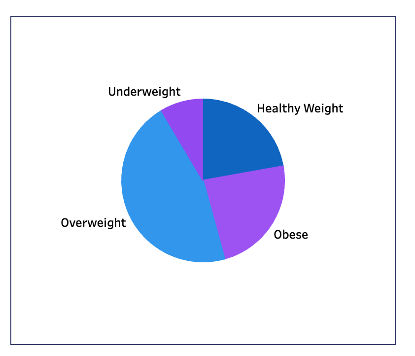
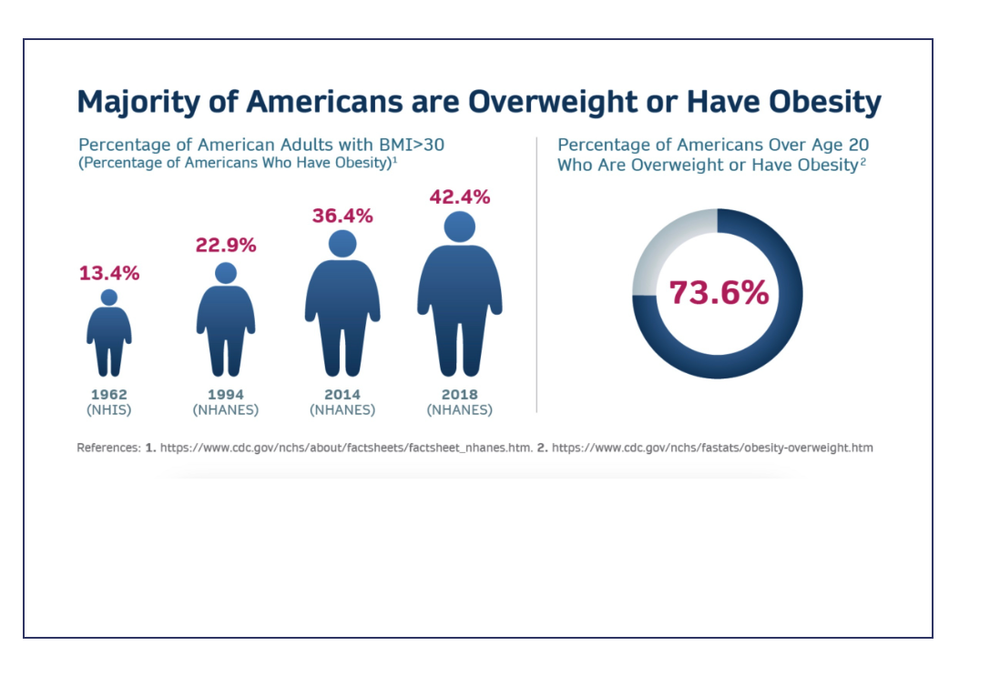
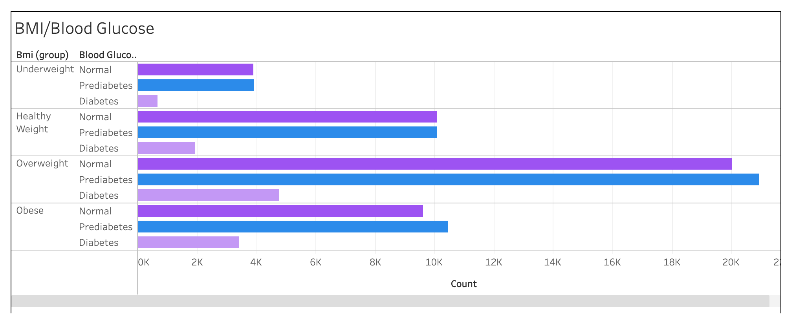
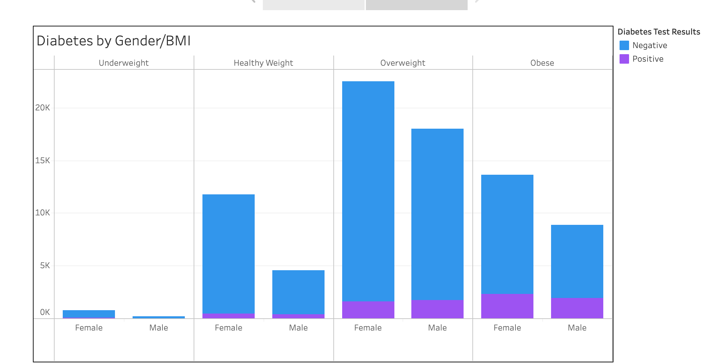
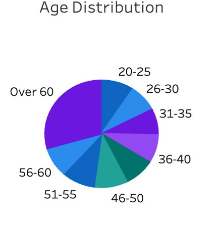
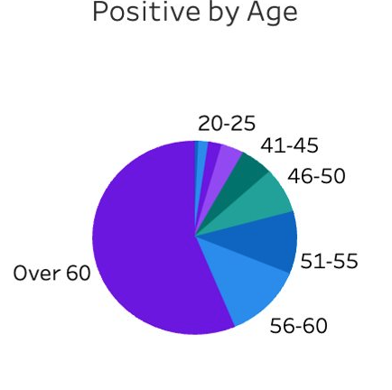

# Project 4: Determining Correlation Between Type 2 Diabetes and High-risk Health Factors
## Table of Contents
* [About](#about)
* [Tools](#tools)
* [Analysis](#analysis)
* [Results](#results)
* [Summary](#summary)
## About
In the final Group 2 project for the June 2023 DU Data Analytics and Visualization Boot Camp, team members Katrina Brown, Triston Cavaness, Lesley Conn and Juliet Hamilton accessed data from Kaggle and the U.S. Centers for Disease Control (CDC) to determine the extent of correlation between diagnosis of Type 2 diabetes onset in male and female populations and the factors of age, body mass index (an obesity indicator), smoking history, hypertension,fasting and non-fasting blood glucose levels, and heart disease. Kaggle data contained 100,000 rows of data; CDC information provided 2018 research on diabetes and obseity for more than 3,141 counties in the United States. One limitation of data in both sources was patient race and/orethnicity, though some hypotheses were developed after mapping the CDC data bsed on county codes, then referencing locations against U.S. Census data for those counties.
## Tools
* Python
* PANDAS
* pathlib
* pyspark
* sklearn.metrics
* Tableau
## Analysis
The Kaggle data was imported, reviewed for nonnulls and data types and an initial histogram view of each data type was developed to document distribution of data by gender and health condition. After the cleanup, the updated data was split into the target and feature variables, followed by a train-test split using sci-kit learn's metric and standard scaling. A logistic regression model was applied to the test portion, resulting in two predictions. Evaluation metrics, including balanced accuracy score, confusion matrix, and classification report, were computed to assess the model's performance.
The first model attained an accuracy score of 95.82% and F1 scores of 98% (Class 0 for detecting no diabetes) and 72% (Class 1 for detecting diabetes) on the harmonic of precision and recall. The noticeable difference in the precision and recall for Class 1 indicates that the model struggled more with correctly identifying instances of diabetes. The second model, employing imblearn.over_sampling, achieved a lower accuracy of 88.55% and F1 scores of 93% (Class 0 for detecting no diabetes) and 57% (Class 1 for detecting diabetes). Examination of the recall scores (a subcomponent of the F1 scores for model predictability accuracy) shows more consistent scoring across the four classes while precision in Class 1 from Model 1 to Model 2 dropped by 50%. That lack of precision, along wtih a greater imbalance across the two classes, results in a lower accuracy for the second model.
Before CDC data could be imported into Tableau, FIPS codes for each county had to be uniformly formatted into a 5-digit code. Additional research was required to ascertain the definitions within the CDC choropleth legend for HH, HM, HL, MH, MM, ML, LH, LM, LL. The acronyms denote combined findings within each U.S. county for high, medium, and low rankings for the often-related conditions of obesity and Type 2 diabetes.

## Results
Both datasets validate the causal relationship between diabetes and factors such as high glucose levels, high body mass index, and hypertension. The Kaggle data offered the most extensive examination of causes, with high A1C and high blood glucose having the strongest correlation. Age and hypertension were close seconds, with affirmed smoking history showing the weakest correlation among behavior-driven causes. 

### Distribution of Data ###

**BMI Distribution:**
- 24% Obese​
- 46% Overweight  

Af first glance I thought the data represented a disporportionate number of individuals in the US that are Overweight/Obese. Unfortunately, according to the National Institutes for Health, 73.6% of Americans are either Overweight or Obese.  

**BMI/Blood Glucose Distribution:**
- Overweight group has highest percentage of people that are Diabetic: 5% of total​
- Overweight group has highest percentage of people that are PREDIABETIC: 21%​  

**BMI Analysis by Gender:**
- Females had a higher percentage of Overweight and Obese compared to Males.​
- Males in the Overweight/Obese categories had a greater tendency than Females to test Positive for Diabetes.

**Age Distribution**
- Diabetes increases with age.  Key age point based on data in the Over 60 group.  ​
- Almost 30% of the participants were in the Over 60 group.​
- More than 50% of the Over 60 group had Diabetes

Examining CDC diabetes data by geographic region also showed frequent correlation between obesity and diabetes while also revealing regional influences. Some of the highest concentrations of high obesity rates and onset of Type 2 diabetes are found in low-income regions Central Appalachia (Eastern Kentucky and Western Virginia), an area also well known for its high rate of "Mountain Dew mouth". Consumption of the high-sugar beverage in the region has resulted in half the population developing peridontal disease and 98% experiencing tooth decay. 
South Carolina also demonstrates one of the most diabetes-dense populations in the country. The rural,low-income county of Williamsburg, according to U.S. Census Data, is populated by blacks and Hispancies at more than two times that of white residents, another indication that race and/or ethnicity and income disparity may play roles in diabetes onset. High concentrations of diabetes and obesity were found in several counties South Dakota. In Bennett County, according to 2021 Census Data, there were 1.64 times more American Indian and Alaska Native (non-Hispanic) residents than any other race or ethnicity. Neighboring Oglala Lakota County, according to 2021 Census Data, is 89.5% American India and Alaska Native. Race alone is not an incidator of obesity and Type 2 diabetes. Northern Maine is another region with high rates of obesity and diabetes, yet its population is majority white with relatively low rates of poverty. Aroostook County in 2021 was 94.5% white with a poverty rate of 17%. (Compared to Ogalala Lakota's 50%) Piscataquis County is 95.4% white and in 2021 had a poverty rate of 10.8%
Some regions, such as west Texas, Colorado, Montana, Idaho and northern and eastern California showed low rates of obesity and diabetes. In 2021, West Texas had more than three times as many white residents as any other ethnicity, and Montana and Colorado are approximately 89% white. Ethnicity alone cannot be established as strongly correlated to low risk of diabetes. Poverty levels in West Texas, Colorado, and Montana are below state and national levels. Climate and higher rates of outdoor activity/lifestyle also are likely factors for lower rates of diabetes, but more research and additional data analysis would be necessary to support that hypothesis.

## Summary
The experience our group gained through this boot camp allowed us to use multiple data analytics tools to rapidly assess and manage large datasets, develop predictive modeling and present multiple visualizations of the data. Based on the modeling and accuracy levels, our analysis showed that predictive modeling was far more adept at identifying patients who did not have diabetes. In both models, the ability to predict diabetes was significantly lower.
In terms of the risk factors, our analysis provided definitive results showing strong correlations of obesity and high glucose. Our geographic analysis uncovered several pockets of high diabetes/high obesity as well as areas of combined low diabetes/low obesity. While the data strongly indicates correlations between ethnicity and income as drivers of diabetes, more research and more patient information would be required for conslusive evidence.
